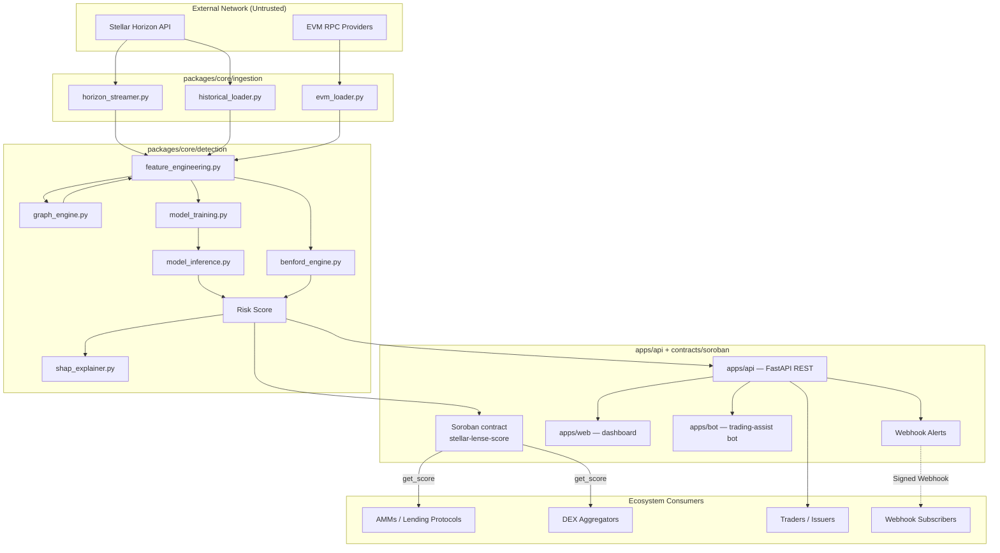

# Stellar Lense 🔍

[](https://stellar.org)
[](https://soroban.stellar.org)
[](#license)
[](https://github.com/Stellar-lens/Stellar-Lense/actions/workflows/ci.yml)

**Wash-trading detection for the Stellar DEX.**

Stellar Lense scores every asset on the Stellar decentralized exchange for wash-trading risk, combining Benford's Law statistical analysis, an ensemble machine-learning layer, and graph-based ring detection — then publishes those scores on-chain via a Soroban smart contract so anyone can verify them independently.

## Table of Contents

- [Repository Layout](#repository-layout)
- [Overview](#overview)
- [Features](#features)
- [Architecture](#architecture)
- [Benford's Law on the Blockchain](#benfords-law-on-the-blockchain)
- [Machine Learning Layer](#machine-learning-layer)
- [Graph-Based Ring Detection](#graph-based-ring-detection)
- [Soroban Smart Contract Layer](#soroban-smart-contract-layer)
- [Quick Start](#quick-start)
- [Design System](#design-system)
- [Observability](#observability)
- [Testing](#testing)
- [Roadmap](#roadmap)
- [Why This Matters for the Stellar Ecosystem](#why-this-matters-for-the-stellar-ecosystem)
- [Dependencies](#dependencies)
- [Security](#security)
- [License](#license)
- [Contributing](#contributing)
- [Support](#support)
- [References](#references)

## Repository Layout

A quick map of the top-level directories so you can navigate the codebase before diving into any one part:

| Directory / File | Language / Toolchain | Role |
|---|---|---|
| `apps/web/` | TypeScript (Next.js) | Product website — landing page, risk-ranking dashboard, alerts feed, asset detail views, news/DD aggregation |
| `apps/api/` | Python (FastAPI) | Public REST API |
| `apps/bot/` | TypeScript | Trading-assist bot — phased: backtest → signal → non-custodial execution |
| `packages/core/` | Python | Detection engine — Horizon ingestion, Benford's Law, ML feature engineering, ensemble training/inference, SHAP, graph ring detection, causal explanations, federated learning |
| `packages/sdk-ts/` | TypeScript (`@stellar-lense/sdk-ts`) | TypeScript client SDK |
| `packages/sdk-py/` | Python (`stellar-lense-sdk`) | Python client SDK |
| `packages/ui/` | TypeScript | Shared design system / component library for `apps/web` |
| `contracts/soroban/` | Rust (Soroban) | On-chain risk-score registry smart contract (`stellar-lense-score`) |
| `data/pipelines/` | Python | Raw + processed trade data, labelled training sets |
| `infra/helm/` | YAML (Helm) | Kubernetes deployment charts |
| `infra/monitoring/` | YAML / JSON | Prometheus alert rules and Grafana dashboards |
| `infra/ci/` | Docs | Notes on the CI workflow (the actual workflow GitHub Actions reads lives at `/.github/workflows`) |
| `docs/` | Markdown | Project plan, design system, build guides — see also each package's own `docs/` (e.g. `packages/core/docs/`) for subsystem-level write-ups |
| `Makefile` | Make | Developer task shortcuts (`make lint-all`, `make test-all`) |

> `packages/core` has its own, more detailed README covering the detection engine's internals (CLI reference, webhook payload format, full endpoint list, etc.) — see [`packages/core/README.md`](packages/core/README.md).

---

## Overview

Stellar Lense is a fraud detection system for the Stellar Decentralised Exchange (SDEX). It ingests trade data from the Stellar Horizon API, scores wallets and asset pairs for wash-trading risk using a combination of Benford's Law digit-distribution analysis and ensemble ML classifiers, and publishes those scores both via a public REST API and an on-chain Soroban contract so other protocols can consume them natively — wrapped in a full product surface (dashboard, alerts, asset detail views, a trading-assist bot) rather than shipping as a bare API.

### The Problem

Wash trading — simultaneously buying and selling the same asset to artificially inflate trading volume — is one of the most pervasive forms of market manipulation in DeFi. Blockchain transparency means every transaction is recorded, but the sheer volume of on-chain activity makes manual detection impossible.

On DEXs, wash trading causes real harm:

- **Traders are misled** into believing an asset has genuine liquidity and market interest when it does not
- **Token issuers manipulate rankings** on DEX aggregators and data platforms by inflating 24-hour volume figures
- **Liquidity providers lose funds** by entering pools that appear active but are dominated by self-dealing activity
- **Ecosystem credibility suffers** — inflated volume metrics on the Stellar DEX undermine confidence from institutional participants, exchanges, and new users

Existing detection approaches are either manual (slow and unscalable) or rely on simple heuristics (easily gamed). No production-grade, open-source wash-trading detection system exists for the Stellar DEX — Stellar Lense is built to fill that gap.

### What Stellar Lense Does

At a high level, it does three things:

- **🔍 Detects** — identifies wallet pairs, trading clusters, and asset pools exhibiting statistically anomalous transaction patterns consistent with wash trading, including circular trade routing, self-matching order behaviour, and artificial volume concentration
- **📊 Scores** — assigns each wallet and each trading pair a risk score (0–100) based on the combined output of its Benford anomaly metrics and ML classifiers, updating continuously as new ledger data is processed
- **📡 Reports** — exposes risk scores and flagged activity through a public API and a full dashboard product, making the intelligence accessible to DEX users, protocol teams, wallet providers, and compliance integrators without requiring technical expertise

## Features

- **Benford's Law Anomaly Engine**: Chi-square, per-digit Z-score, and MAD analysis of transaction amounts across rolling time windows (1h, 4h, 24h, 7d, 30d)
- **Ensemble ML Scoring**: Random Forest, XGBoost, and LightGBM classifiers trained on labelled wash-trade patterns with SHAP interpretability
- **Temporal Sequence Model**: sequence model over a wallet's ordered trade history, detecting temporal patterns invisible to aggregate features
- **Cross-Chain Detection**: links Stellar wallets to EVM counterparts via bridge events; detects round-trip wash-trade patterns across chains
- **On-Chain Risk Registry**: Soroban smart contract exposes risk scores so AMMs, lending protocols, and aggregators can gate suspicious activity natively
- **Public REST API**: query scores, recent alerts, and asset risk rankings
- **Full Product Surface**: risk-ranking dashboard, per-asset detail views, a wash-trading alert feed, market news/DD aggregation, and a phased trading-assist bot
- **GNN Ring Detection**: graph neural network classifier that scores wash-trading ring membership directly from the trade graph, complementing the SCC-based detector
- **Federated Learning**: privacy-preserving cross-deployment model training with Byzantine-resilient aggregation and differential privacy
- **Causal Explanations**: do-calculus average treatment effects on top of SHAP, answering "would this wallet still be flagged if it fixed its Benford distribution?"
- **Adversarial Robustness**: attack, certificate, and hardening evaluation tooling

## Architecture



### Core Components

- **`packages/core/ingestion/`**: Horizon streaming and historical trade ingestion, EVM bridge-event ingestion, filter pipeline
- **`packages/core/detection/`**: Benford's Law engine, feature engineering, graph ring detection, ensemble model training/inference, SHAP + causal explainability
- **`apps/api/`**: public-facing FastAPI service serving risk scores
- **`apps/web/`**: the dashboard, alerts feed, and asset detail views
- **`apps/bot/`**: the trading-assist bot (see [Roadmap](#roadmap) for phase status)
- **`contracts/soroban/`**: the on-chain risk registry contract

See [`packages/core/README.md`](packages/core/README.md#core-components) for the full module-by-module breakdown of the detection engine.

## Benford's Law on the Blockchain

Benford's Law predicts that the leading digit of naturally occurring transaction amounts follows a known, non-uniform distribution (digit 1 ≈ 30.1%, digit 9 ≈ 4.6%). Wash-trading bots tend to use fixed lot sizes or round/algorithmic amounts, producing distributions that diverge from this expectation.

| Metric | What it measures |
| --- | --- |
| **Chi-square statistic** | Whether the overall digit distribution deviates significantly from Benford's expected distribution |
| **Chi-square p-value** | Statistical significance of the chi-square deviation — Monte Carlo bootstrap when N < 100 transactions, asymptotic chi-square otherwise |
| **Z-score (per digit)** | Whether any individual digit (1–9) appears with significantly higher or lower frequency than expected |
| **Mean Absolute Deviation (MAD)** | Composite divergence measure |

Benford signals alone are insufficient (legitimate market makers can also be non-Benford), so they are combined with the ML layer below. Full methodology in [`packages/core/docs/benford_analysis.md`](packages/core/docs/benford_analysis.md).

## Machine Learning Layer

35 baseline features across five groups — Benford features (chi-square/Z-score/MAD across rolling windows), trade pattern features (counterparty concentration, round-trip frequency, self-matching rate, cancellation rate), volume and timing features, wallet graph features (funding-source similarity, centrality, ring membership), and cross-pair features (synchrony, burst overlap, shared wallet clusters).

| Model | Role |
| --- | --- |
| **Random Forest** | Stable baseline; handles missing features gracefully |
| **XGBoost** | Primary classifier; strongest performance on tabular on-chain data |
| **LightGBM** | High-speed inference for real-time scoring |

Models are trained with SMOTE for class imbalance and evaluated with AUC-ROC, Precision-Recall AUC, and F1-score. SHAP values provide per-score interpretability; a causal-inference layer on top of SHAP separates correlational from causal feature contributions. See [`packages/core/README.md#machine-learning-layer`](packages/core/README.md#machine-learning-layer) for the full feature list and interpretability design.

## Graph-Based Ring Detection

`detection/graph_engine.py` builds a directed weighted trade graph where nodes are Stellar accounts and edges point from seller to buyer, aggregating volume and trade count per edge. Wash-ring discovery uses iterative Tarjan's SCC algorithm rather than pairwise thresholds, with an explicit work-stack so it handles arbitrarily large graphs without hitting Python's recursion limit. Beyond a configurable node-count threshold, the pipeline falls back to a sharded graph engine that partitions the graph across workers using Louvain modularity maximisation.

A GNN classifier complements the SCC-based detector, scoring ring membership directly from the trade graph. See [`packages/core/docs/gnn_ring_detection.md`](packages/core/docs/gnn_ring_detection.md) and [`packages/core/README.md#graph-based-ring-detection`](packages/core/README.md#graph-based-ring-detection) for scale targets and configuration.

## Soroban Smart Contract Layer

The Soroban contract (`stellar-lense-score`, in `contracts/soroban/`) is the on-chain truth layer for risk scores.

- `submit_score(...)` — registers a computed risk score on-chain (authorised service path only)
- `get_score(wallet, asset_pair) -> RiskScore` — read-only; callable by any other Soroban contract

This composability lets AMMs, lending protocols, and DEX aggregators on Stellar query Stellar Lense scores natively — for example, gating liquidity provision from wallets above a configurable risk threshold — without an external oracle.

Two ZK backends support proving that a score meets a threshold without revealing it: a setup-free Pedersen Sigma-protocol (default) and a Groth16 zk-SNARK alternative with constant proof size. The oracle aggregator and ZK verifier contracts are continuously fuzzed with `cargo-fuzz`. See [`contracts/soroban/README.md`](contracts/soroban/README.md) for the contract's own detailed docs, current audit-prep status, and mainnet-readiness checklist.

## Quick Start

> This is a solo, closed-development project — not currently accepting outside contributions. Setup notes below are for local development reference.

```bash
git clone https://github.com/Stellar-lens/Stellar-Lense.git
cd Stellar-Lense

# JS/TS workspaces (apps/web, apps/bot, packages/sdk-ts, packages/ui)
pnpm install

# Python workspace (packages/core, apps/api)
uv sync

# Rust contract workspace (contracts/soroban)
cd contracts/soroban && cargo build
```

Run the full lint/test suite across all three toolchains — the same commands CI runs on every PR into `main`:

```bash
make lint-all
make test-all
```

See each app's own README for service-specific run instructions: [`apps/web`](apps/web), [`apps/api`](apps/api/README.md), [`apps/bot`](apps/bot), and [`packages/core`](packages/core/README.md) for the detection engine's own CLI reference, webhook alert setup, and full endpoint list.

## Design System

The visual and typographic system — color tokens, type scale, layout principles — is documented in [`docs/DESIGN_SYSTEM.md`](docs/DESIGN_SYSTEM.md) and mirrored in the [Figma file](https://www.figma.com/design/hRiGmu5WcbVgmB0TuNZfCy/Steller-Lens). Dark, dense, data-forward — closer to a trading terminal than a generic SaaS dashboard, with a single Poppins type family carrying the full hierarchy.

## Observability

- **Structured JSON logging** — every log record carries `timestamp`, `level`, `correlation_id`, and `trace_id` fields
- **Correlation IDs** — each pipeline pass and API request is assigned a UUID4 that threads through all log lines and spans
- **OpenTelemetry tracing** — spans for pipeline runs, model scoring, Soroban submission, and webhook delivery
- **Prometheus metrics** — scoring throughput, latency, Soroban submissions, circuit breaker state, webhook delivery health, drift events, model AUC-ROC
- **Alerting rules** — multi-window, multi-burn-rate SLO alerts in `infra/monitoring/` (see `docs/slo.md`)
- **Wallet masking** — Stellar wallet addresses are truncated in all log output; no PII in metric labels

## Testing

```bash
make lint-all
make test-all
```

Covers, across the three workspaces: Benford's Law feature computation, ML feature engineering and graph-ring features, wash-ring discovery and storage, synthetic data generation, risk-score combination logic, the public API and CLI, Horizon HTTP retry/backoff behaviour, and fuzz-tested ingestion parsers and Soroban contract entrypoints.

## Roadmap

Full detail in [`docs/stellar-lens-project-plan.md`](docs/stellar-lens-project-plan.md). Summary:

- [x] Monorepo consolidation, history preserved
- [x] Rebrand pass
- [x] Website rebuild — landing page + risk-ranking dashboard
- [x] Alerts feed, asset detail views, news/DD aggregation
- [x] Trading-assist bot, Phase 1: backtesting engine (no live funds)
- [ ] Get `packages/core`'s pytest suite green in CI, then turn on branch protection
- [ ] Trading-assist bot, Phase 2: live signal/alert bot
- [ ] Trading-assist bot, Phase 3: non-custodial execution via scoped Soroban session permissions — **gated on independent security review**
- [ ] Public launch

## Why This Matters for the Stellar Ecosystem

A DEX where volume figures can't be trusted is one that institutional participants and serious traders avoid. Stellar Lense addresses this directly:

- **For traders** — risk scores show which assets have genuine liquidity, without requiring on-chain expertise
- **For asset issuers** — a low risk score is a credibility signal for listings and investor materials
- **For protocol teams** — integrate Stellar Lense scores into AMM/lending contract logic to protect users from wash-traded assets
- **For the Stellar ecosystem** — an open, verifiable fraud-detection layer strengthens Stellar's case as trustworthy financial infrastructure

## Dependencies

Three independent toolchains, by design — the stack is intentionally mixed and each language keeps its native workspace tool rather than forcing one build system across all of it:

| Layer | Tool | Members |
|---|---|---|
| JS/TS | [pnpm](https://pnpm.io) workspaces | `apps/web`, `apps/bot`, `packages/sdk-ts`, `packages/ui` |
| Python | [uv](https://docs.astral.sh/uv/) workspace | `packages/core`, `apps/api` (`packages/sdk-py` is standalone, published independently) |
| Rust | Cargo workspace | `contracts/soroban` |

Core libraries: FastAPI, scikit-learn, XGBoost, LightGBM, SHAP, `soroban-sdk`, Next.js.

## Security

The Soroban contract publishes on-chain risk data and will eventually gate bot execution permissions. Mainnet deployment is gated on an independent security review — see [`contracts/soroban/README.md`](contracts/soroban/README.md) for the current audit-prep status. Found a vulnerability? Please don't open a public issue — [contact details to be added before public launch].

## License

[License to be finalized before public launch — confirm terms before removing public access to any previously open-sourced component.]

## Contributing

This is a solo, closed-development project — not currently accepting outside contributions.

Quick checklist for anyone working in this repo:

- All tests pass: `make lint-all && make test-all`
- Code follows project style guidelines
- New features include tests
- Documentation is updated

## Support

- [`docs/`](docs/) — project plan, design system, build guides
- [`packages/core/docs/`](packages/core/docs/) — subsystem-level write-ups (threat model, event bus, uncertainty quantification, and more)
- GitHub Issues: [Create an issue](https://github.com/Stellar-lens/Stellar-Lense/issues)
- Stellar Discord: https://discord.gg/stellar

## References

- Benford, F. (1938) 'The law of anomalous numbers', _Proceedings of the American Philosophical Society_, 78(4), pp. 551–572.
- Al Ali, A. et al. (2023) 'A powerful predicting model for financial statement fraud based on optimized XGBoost ensemble learning technique', _Applied Sciences_, 13(4).
- Antonio, G.R. (2023) 'Numbers don't lie: Decoding financial error and fraud through Benford's law', _Journal of Entrepreneurship_.
- Nti, I.K. and Somanathan, A.R. (2024) 'A scalable RF-XGBoost framework for financial fraud mitigation', _IEEE Transactions on Computational Social Systems_, 11(2), pp. 410–422.
- Yadavalli, R. and Polisetti, R. (2025) 'Optimized financial fraud detection using SMOTE-enhanced ensemble learning with CatBoost and LightGBM', _ICVADV 2025_.
- Harea, R. and Mihailă, S. (2025) 'Benford's law: Applicability in accounting and financial anomaly detection', _Challenges of Accounting for Young Researchers_, 3(1).
- Stellar Development Foundation (2024) _Horizon API Documentation_. Available at: https://developers.stellar.org/api/horizon
- Stellar Development Foundation (2024) _Soroban Smart Contract Documentation_. Available at: https://soroban.stellar.org/docs

---

<div align="center">

**Stellar Lense** — Making the Stellar ledger legible.

</div>
